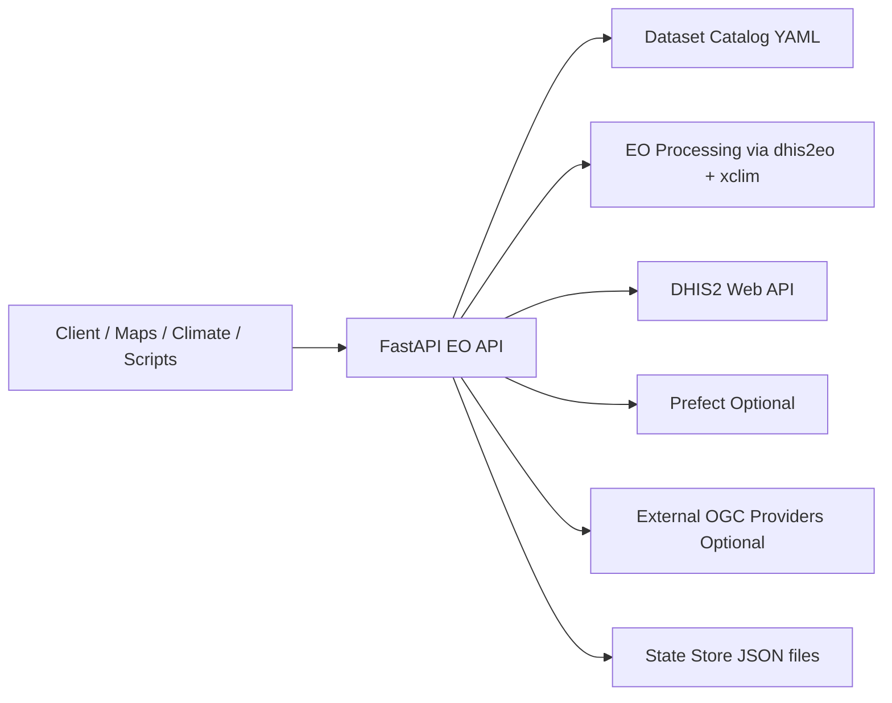
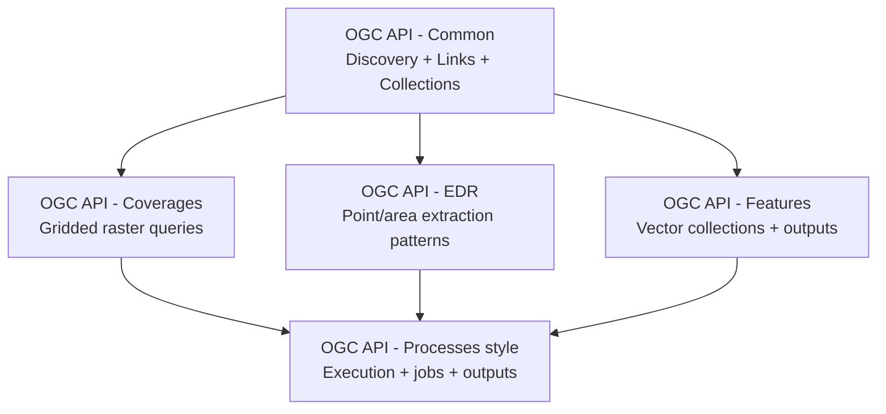

# DHIS2 EO API

## Unified Earth Observation processing for DHIS2 and CHAP

- Standards-aligned geospatial API for discovery, processing, and ingestion
- Replaces key Google Earth Engine-dependent integration paths
- Built for no-code-friendly operational workflows

---

# Why this API exists

## Problem

- EO and climate workflows are often fragmented across scripts and tools
- Hard to repeat, schedule, validate, and operationalize at scale

## Goal

- One API surface for:
  - Dataset discovery
  - EO processing
  - Aggregation to DHIS2 org units
  - Import-ready outputs
  - Scheduled recurring runs

---

# Who it serves

- DHIS2 implementers and analysts
- Climate and health data teams
- GIS and data engineering teams
- DHIS2 Maps app and DHIS2 Climate app as primary consumers

---

# Architecture at a glance

---

# Technology choices

- API framework: FastAPI
- OGC alignment: pygeoapi patterns
- Raster endpoints: TiTiler COG routes
- EO processing: dhis2eo
- Climate indices: xclim
- Orchestration: Prefect (optional), internal scheduler (optional)
- Persistence: JSON state files (jobs, schedules, workflows)

---

# Core resources and concepts

- Collections: discover available datasets
- Coverage and EDR queries: inspect raster values and areas
- Processes: executable units of work
- Jobs: async run status and results
- Workflows: multi-step process pipelines
- Schedules: recurring execution of process inputs or workflows

---

# OGC APIs used: what, how, why

Used in this API:

- **OGC API - Common**: landing page + collection discovery (`/`, `/collections`)
- **OGC API - Coverages**: gridded raster access (`/collections/{id}/coverage`)
- **OGC API - EDR**: direct query patterns for point/area extraction (`/position`, `/area`)
- **OGC API - Features**: vector collections for org units and outputs (`/features/*`)
- **OGC API - Processes (style)**: process catalog + execution (`/processes/*`)

How they relate:

- `Common` provides dataset identities and link relations
- `Coverages` + `EDR` are complementary views over the same collections
- `Processes` consume collection-based inputs and emit job/output links
- `Features` carries both input geometries and process outputs

Why this mix:

- Interoperability with geospatial tools and ecosystem clients
- Predictable contracts for DHIS2 Maps/Climate integration
- Composable workflow model (discover → query → process → import)

---

# OGC standards stack (visual)

- `Common` anchors identities and link relations.
- `Coverages`, `EDR`, and `Features` provide complementary data-access paths.
- `Processes` orchestrates execution over those resources and produces import-ready outputs.

---

# Dataset model

- File-driven catalog under eoapi/datasets
- One folder per dataset
- YAML metadata validated by Pydantic
- Dataset-specific resolver logic per source
- Enables adding datasets with minimal endpoint changes

---

# Endpoint map

## Discovery and standards

- GET /
- GET /conformance
- GET /collections
- GET /collections/{collectionId}

## Data access

- GET /collections/{collectionId}/coverage
- GET /collections/{collectionId}/position
- GET /collections/{collectionId}/area
- GET /features
- GET /features/{collectionId}/items

## Execution

- GET /processes
- GET /processes/{processId}
- POST /processes/{processId}/execution
- GET /jobs/{jobId}

## Orchestration

- CRUD /workflows + POST /workflows/{workflowId}/run
- CRUD /schedules + POST /schedules/{scheduleId}/run

---

# How execution works

1. Client posts process inputs
2. API validates payload and dataset/parameter contracts
3. EO extraction and aggregation run (dhis2eo first, fallback if needed)
4. Output converted to import-ready dataValues
5. DHIS2 import is executed or simulated (dry run)
6. Job status and outputs are persisted and queryable

---

# Supported process catalog

- eo-aggregate-import
- xclim-cdd (consecutive dry days)
- xclim-cwd (consecutive wet days)
- xclim-warm-days

Each process produces:

- Import summary
- Feature outputs
- Traceable job status

---

# DHIS2 integration behavior

- Live integration enabled via environment variables
- Org units can be fetched directly from DHIS2
- Process outputs are converted to DHIS2 dataValueSets payloads
- Dry-run mode validates and previews without committing writes
- Safe fallback behavior for local/dev when DHIS2 is not configured

---

# Workflow orchestration

- Workflows store ordered process steps
- Each step executes using the same process contracts
- Run returns all step job IDs for traceability
- Schedules can target:
  - Process inputs
  - Or a saved workflow ID

---

# Scheduling options

## Internal scheduler

- Poll-based cron worker built into API process
- Runs enabled schedules at due times

## Prefect integration

- Optional offloading of schedule runs to Prefect deployments
- Job status can sync from Prefect flow states

---

# External OGC federation

- Merge external providers into local collections catalog
- Federated collection IDs: ext:{providerId}:{sourceCollectionId}
- Proxy coverage and EDR operations to upstream services
- Per-provider controls:
  - Auth headers and API keys
  - Timeouts and retries
  - Allowed operations (coverage, position, area)

---

# Runtime operations and safety

- Persistent state for jobs, schedules, workflows
- Runtime summary exposed on landing page for operators
- Configurable CORS origins
- Optional API key guard for write routes
- Clear endpoint error contracts (NotFound, InvalidParameterValue, etc.)

---

# Typical demo flow

1. Discover datasets with GET /collections
2. Inspect one dataset with GET /collections/{id}
3. Preview data using coverage/position/area
4. Execute eo-aggregate-import in dry run
5. Check job via GET /jobs/{jobId}
6. View features via GET /features/aggregated-results/items?jobId=...
7. Create workflow and run it
8. Add schedule for recurring execution

---

# What is production-ready now

- Core API surface and contracts
- Multi-process execution including xclim
- Workflow and schedule orchestration
- Optional Prefect integration
- External OGC federation with hardening controls
- Durable local state persistence

---

# Next steps to scale further

- Add metrics dashboards and alerting around scheduler/import failures
- Expand DHIS2 mapping options for multi-data-element scenarios
- Strengthen deployment profile (container, secrets, env templates)
- Add comparison benchmarks against existing GEE-based pipelines

---

# Quick start for this demo

- Install dependencies: make sync
- Run API: make run
- Open docs: /docs
- Open examples: API_EXAMPLES.md
- Open demo UI: /example-app

---

# Closing

DHIS2 EO API provides a practical, standards-aligned bridge from EO data to DHIS2 operations:

- Discover
- Process
- Validate
- Schedule
- Import

All through one coherent API.
