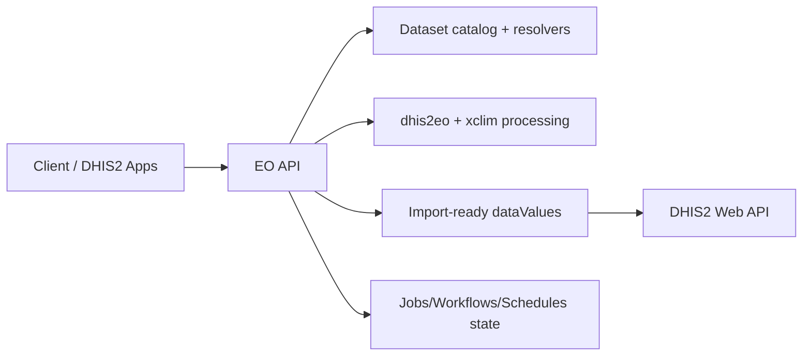
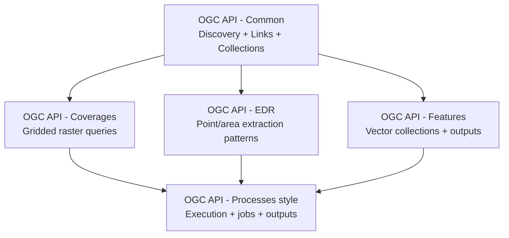

# DHIS2 EO API
## Executive Brief (10 slides)

- Unified API for Earth Observation data into DHIS2 and CHAP
- Standards-aligned, operational, and no-code-friendly
- Built to reduce dependence on fragmented scripts and GEE-only paths

---

# 1) Why this matters

- Climate and EO workflows are often brittle and hard to repeat
- Teams need one reliable interface for discovery, processing, and import
- This API turns EO pipelines into auditable, schedulable operations

---

# 2) What the API delivers

- Dataset discovery (`/collections`)
- Data preview (`/coverage`, `/position`, `/area`)
- Process execution (`/processes/*/execution`)
- Async job tracking (`/jobs/{jobId}`)
- Workflow + schedule orchestration (`/workflows`, `/schedules`)

---

# 3) How it works end-to-end

---

# 4) OGC APIs used: what, how, why

Used in this API:
- **OGC API - Common**: landing page + collection discovery (`/`, `/collections`)
- **OGC API - Coverages**: gridded raster access (`/collections/{id}/coverage`)
- **OGC API - EDR**: direct query patterns for point/area extraction (`/position`, `/area`)
- **OGC API - Features**: vector collections for org units and outputs (`/features/*`)
- **OGC API - Processes (style)**: process catalog + execution (`/processes/*`)

How they relate:
- `Common` provides dataset identities and links
- `Coverages` + `EDR` are complementary views over the same collections
- `Processes` consume collection-driven inputs and publish job/output links
- `Features` carries both input geometries (org units) and process outputs

Why this mix:
- Interoperability with geospatial tools and clients
- Predictable contracts for DHIS2 Maps/Climate integration
- Composable architecture (discover → query → process → import)

---

# OGC standards stack (visual)

- `Common` anchors identities and link relations.
- `Coverages`, `EDR`, and `Features` provide complementary data-access paths.
- `Processes` orchestrates execution over those resources and produces import-ready outputs.

---

# 5) Process capabilities today

- `eo-aggregate-import`
- `xclim-cdd`
- `xclim-cwd`
- `xclim-warm-days`

Outputs include:
- Import summary
- Feature-level results
- Traceable job state

---

# 6) Orchestration options

- Saved multi-step workflows (`/workflows`)
- Recurring schedules (`/schedules`)
- Internal cron worker for built-in recurring runs
- Optional Prefect integration for external orchestration and status sync

---

# 6b) Orchestrator scorecard (weighted)

Scoring basis:
- 1–5 score scale across API fit, time to production, ops overhead, reliability, governance, dev speed, scale, and cost.

| Option | Weighted total (/100) |
|---|---:|
| Prefect | **87** |
| Dagster | 68 |
| Airflow | 67 |
| Temporal | 66 |
| Argo Workflows | 61 |
| Internal scheduler only | 59 |

Decision for current phase:
- Choose **Prefect** as primary orchestrator.
- Keep internal scheduler as fallback.
- Re-evaluate if enterprise governance constraints become dominant.

---

# 7) Operational resilience

- Durable local persistence for jobs/schedules/workflows
- Runtime summary at landing page (`GET /`) for operator visibility
- Configurable CORS and optional API-key write protection
- Clear error contracts for fast debugging

---

# 8) Federation and extensibility

- External OGC providers can be merged into local catalog
- Provider-level auth, timeout, retry, and operation toggles
- File-driven dataset onboarding keeps extension cost low

---

# 9) Demo storyline (5 minutes)

1. Discover datasets (`GET /collections`)
2. Preview climate data (`/coverage` or `/position`)
3. Execute dry-run import process
4. Track job + inspect feature results
5. Run workflow and attach schedule

---

# 10) Key takeaway

DHIS2 EO API is now a practical integration backbone for EO/climate operations:

- Discover confidently
- Process consistently
- Schedule reliably
- Import safely into DHIS2

Ready for incremental production hardening and broader dataset/process expansion.
