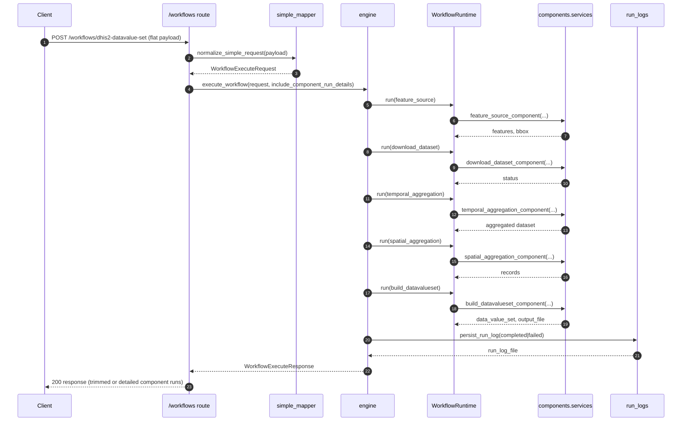

# Workflow Orchestration Design (Single Endpoint, Componentized Runtime)

## Purpose

This document describes the implemented approach for generating a DHIS2 DataValueSet from gridded EO datasets through one workflow endpoint and reusable components.

It documents:

1. What has been achieved.
2. The architecture and execution flow.
3. Public API contract and normalization rules.
4. Runtime metadata, observability, and error handling.
5. Current componentization strategy and extension path.

---

## What Is Implemented

The current implementation provides:

1. One canonical workflow execution endpoint:
   - `POST /workflows/dhis2-datavalue-set`
2. One public flat request payload contract (`WorkflowRequest`).
3. Internal normalization into a canonical execution model (`WorkflowExecuteRequest`).
4. A fixed generic orchestration chain with exactly 5 components:
   - `feature_source`
   - `download_dataset`
   - `temporal_aggregation`
   - `spatial_aggregation`
   - `build_datavalueset`
5. Per-component runtime instrumentation (`WorkflowRuntime`) with timing, status, and summarized inputs/outputs.
6. Run-log persistence for both success and failure.
7. Structured error responses, including upstream connectivity failures.
8. Optional inclusion of detailed component run traces in API responses.
9. Discoverable standalone component endpoints under `/components` for direct execution and future orchestrator integration.
10. Declarative workflow assembly via YAML (`data/workflows/dhis2_datavalue_set.yaml`) executed by the workflow engine.
11. Registry-driven component dispatch in engine (no component-specific `if/elif` chain).
12. Step-level YAML config support with strict validation and `$request.<field>` interpolation.
13. Stable workflow error contract with `error_code` and `failed_component_version`.

---

## Final API Surface

### Primary Workflow Endpoint

- `POST /workflows/dhis2-datavalue-set`

### Workflow Discovery Endpoint

- `GET /workflows` (discovered workflow catalog from `data/workflows/*.yaml` with `workflow_id`, `version`, and component chain)

### Component Discovery/Execution Endpoints

- `GET /components`
- `POST /components/feature-source`
- `POST /components/download-dataset`
- `POST /components/temporal-aggregation`
- `POST /components/spatial-aggregation`
- `POST /components/build-datavalue-set`

`/components/*` endpoints are for reusable task-level execution. The workflow endpoint remains the single end-to-end API for generating DHIS2 DataValueSet output.

---

## Public Workflow Request Contract

The workflow endpoint accepts one flat payload shape:

```json
{
  "workflow_id": "dhis2_datavalue_set_v1",
  "dataset_id": "chirps3_precipitation_daily",
  "start_date": "2024-01-01",
  "end_date": "2024-05-31",
  "org_unit_level": 2,
  "data_element": "DE_UID",
  "temporal_resolution": "monthly",
  "temporal_reducer": "sum",
  "spatial_reducer": "mean",
  "include_component_run_details": false
}
```

Important fields:

1. `dataset_id` (required)
2. `workflow_id` (optional, default `dhis2_datavalue_set_v1`, must exist in discovered workflow YAMLs)
3. Time window (required as one of):
   - `start_date` + `end_date`, or
   - `start_year` + `end_year`
4. Spatial scope (required as one of):
   - `org_unit_level`, or
   - `org_unit_ids`
5. `data_element` (required)
6. `include_component_run_details` (optional, default `false`)

Notes:

1. `feature_id_property` defaults to `"id"` and controls which feature property maps to DHIS2 org unit ID in spatial aggregation/DataValueSet construction.
2. `country_code` is accepted in request and passed to dataset downloaders (instead of forcing `.env` only).

---

## Normalization and Mapping Approach

File: `src/eo_api/workflows/services/simple_mapper.py`

Public flat payload is normalized to internal `WorkflowExecuteRequest` with component-ready nested configs:

1. `feature_source` config:
   - `org_unit_level` -> `source_type=dhis2_level`
   - `org_unit_ids` -> `source_type=dhis2_ids`
2. `temporal_aggregation` config:
   - `target_period_type` from `temporal_resolution`
   - `method` from `temporal_reducer`
3. `spatial_aggregation` config:
   - `method` from `spatial_reducer`
4. `dhis2` config:
   - `data_element_uid` from `data_element`

Time normalization depends on dataset registry metadata (`period_type`):

1. Yearly datasets:
   - normalize to `YYYY`
2. Hourly/Daily/Monthly datasets:
   - normalize to month windows (`YYYY-MM`) for downloader compatibility
3. Fallback:
   - pass date strings as provided

This mapping keeps the public contract simple while preserving an extensible internal orchestration model.

---

## Architecture

### API Routing Layer

Files:

1. `src/eo_api/workflows/routes.py`
2. `src/eo_api/components/routes.py`
3. `src/eo_api/main.py`

Responsibilities:

1. Expose one workflow endpoint and reusable component endpoints.
2. Keep payload and response models explicit with Pydantic.
3. Delegate execution logic to service layers.

### Workflow Engine Layer

File: `src/eo_api/workflows/services/engine.py`

Responsibilities:

1. Validate dataset existence via registry.
2. Execute the 5 components in fixed order.
3. Collect runtime telemetry for each component.
4. Persist run logs on both success and error paths.
5. Return workflow result with optional component-run detail inclusion.

### Workflow Definition Layer

Files:

1. `src/eo_api/workflows/services/definitions.py`
2. `data/workflows/dhis2_datavalue_set.yaml`

Responsibilities:

1. Discover, load, and validate declarative workflow definitions from `data/workflows/*.yaml`.
2. Enforce supported component names.
3. Enforce supported component versions (currently `v1`) and validate per-step `config`.
4. Enforce terminal `build_datavalueset` step for this end-to-end workflow.
5. Enforce output-to-input compatibility across the full accumulated context (not just adjacent steps).
6. Drive runtime execution order from YAML through a registry-dispatch model.

### Reusable Component Service Layer

File: `src/eo_api/components/services.py`

Responsibilities:

1. Provide discoverable component catalog metadata.
2. Implement component functions used by:
   - workflow engine, and
   - `/components/*` task endpoints.
3. Reuse existing EO API capabilities (`downloader`, `accessor`, temporal/spatial aggregators, DataValueSet builder).

---

## Layering Rationale

The repository uses three layers with different responsibilities:

1. `data_xxx` services (`data_manager`, `data_accessor`, `data_registry`)
   - Core domain capabilities (download, load/subset, dataset metadata).
   - No workflow-specific orchestration state required.
2. `components/`
   - Thin reusable wrappers around core capabilities.
   - Standardized component contracts for discovery (`GET /components`) and direct task execution.
   - Runtime-friendly boundaries for future orchestrators (Prefect/Airflow).
3. `workflows/`
   - End-to-end orchestration, request normalization, workflow selection, runtime tracing, and run-log persistence.
   - Declarative assembly from `data/workflows/*.yaml`.

Example:

1. `download_dataset` workflow/component step delegates actual download work to `src/eo_api/data_manager/services/downloader.py`.
2. The wrapper adds orchestration-level concerns (preflight, context wiring, component runtime metadata) without duplicating downloader logic.

This separation keeps core data services reusable and prevents workflow-specific concerns from leaking into the low-level data modules.

---

## Component Chain (Exact Runtime Order)

The workflow engine executes these components, no more and no less:

1. `feature_source`
2. `download_dataset`
3. `temporal_aggregation`
4. `spatial_aggregation`
5. `build_datavalueset`

Details:

1. `feature_source`
   - Resolves features from DHIS2 org unit level/ids or GeoJSON source config.
   - Returns `FeatureCollection` and `bbox`.
2. `download_dataset`
   - Runs connectivity preflight and downloads source data using `data_manager/services/downloader.py`.
   - Supports request-supplied `country_code` where needed (e.g., WorldPop).
3. `temporal_aggregation`
   - Loads/subsets data and performs period aggregation with selected reducer.
4. `spatial_aggregation`
   - Aggregates gridded data over feature geometries.
   - Produces normalized record rows (`org_unit`, `time`, `value`).
5. `build_datavalueset`
   - Builds valid DHIS2 DataValueSet JSON from records.
   - Serializes output to file and returns both payload and output path.

Execution order and step metadata are currently defined in:

- `data/workflows/dhis2_datavalue_set.yaml`

Workflow step schema now supports:

1. `component`
2. `version` (default `v1`)
3. `config` (default `{}`)

The default YAML remains the same 5-step sequence, but the engine reads it declaratively and dispatches components through a registry map.

---

## Runtime Observability and Housekeeping

File: `src/eo_api/workflows/services/runtime.py`

For each component run, runtime captures:

1. `component`
2. `status`
3. `started_at`
4. `ended_at`
5. `duration_ms`
6. `inputs` (summarized)
7. `outputs` (summarized)
8. `error` (on failure)

Each workflow execution gets a unique `run_id`.

### Response-Level Control of Run Details

`include_component_run_details` controls response verbosity:

1. If `false`:
   - `component_runs: []`
   - `component_run_details_included: false`
   - `component_run_details_available: true`
2. If `true`:
   - `component_runs` contains full per-component run records
   - `component_run_details_included: true`
   - `component_run_details_available: true`

This keeps default responses clean while preserving debuggability when explicitly requested.

---

## Run Logs

File: `src/eo_api/workflows/services/run_logs.py`

Workflow run logs are persisted under:

- `<DOWNLOAD_DIR>/workflow_runs/`

Persisted fields include:

1. `run_id`
2. `status` (`completed` or `failed`)
3. normalized request payload
4. `component_runs`
5. output file path (when completed)
6. error details (when failed)
7. `error_code` (when failed)
8. `failed_component` (when failed)
9. `failed_component_version` (when failed)

---

## Error Handling Strategy

1. `422` for request/definition/config validation failures.
2. `404` when `dataset_id` does not exist in registry.
3. `503` for upstream connectivity failures:
   - `error: "upstream_unreachable"`
   - `error_code: "UPSTREAM_UNREACHABLE"`
4. `500` for other execution failures:
   - `error: "workflow_execution_failed"`
   - `error_code: "EXECUTION_FAILED"` (or other stable mapped codes)

Failure responses include:

1. `error_code`
2. `failed_component`
3. `failed_component_version`
4. `run_id`

---

## Testing and Quality Gates

Primary tests:

- `tests/test_workflows.py`

Coverage includes:

1. Single workflow endpoint behavior.
2. Payload validation and normalization paths.
3. Exact 5-component orchestration order.
4. Component detail include/exclude behavior.
5. Upstream connectivity error mapping.
6. Component catalog endpoint expectations.
7. Declarative workflow definition loading and default step validation.
8. Engine execution follows the definition-provided step order.

Quality gates:

1. `make lint` (ruff, mypy, pyright)
2. `uv run pytest -q`

---

## Why This Approach

This design intentionally balances:

1. Simplicity for clients:
   - one end-to-end endpoint and one public payload.
2. Generic dataset support:
   - dataset-specific behavior comes from registry metadata and downloader wiring, not endpoint proliferation.
3. Reusability:
   - component services are discoverable and executable independently.
4. Future orchestration readiness:
   - component boundaries and run metadata are explicit, making Prefect/Airflow integration straightforward.

---

## Sequence Diagram



Failure path:

1. Any component exception is captured by runtime on the failing step.
2. Engine persists failed run log with `run_id` and `failed_component`.
3. Engine returns structured error:
   - `503` with `error=upstream_unreachable` for connectivity failures.
   - `500` with `error=workflow_execution_failed` for all other failures.

---

## Manual E2E Testing

Use the following commands to validate discovery, execution, and error behavior end-to-end.

1. Start API:

```bash
uvicorn eo_api.main:app --reload
```

2. Verify discovered workflows:

```bash
curl -s http://127.0.0.1:8000/workflows | jq
```

3. Run default 5-step workflow:

```bash
curl -s -X POST "http://127.0.0.1:8000/workflows/dhis2-datavalue-set" \
  -H "Content-Type: application/json" \
  -d '{
    "workflow_id": "dhis2_datavalue_set_v1",
    "dataset_id": "chirps3_precipitation_daily",
    "start_date": "2024-01-01",
    "end_date": "2024-02-29",
    "org_unit_level": 2,
    "data_element": "DE_UID",
    "temporal_resolution": "monthly",
    "temporal_reducer": "sum",
    "spatial_reducer": "mean",
    "include_component_run_details": true
  }' | jq
```

Expected component order:

1. `feature_source`
2. `download_dataset`
3. `temporal_aggregation`
4. `spatial_aggregation`
5. `build_datavalueset`

4. Run 4-step workflow (without temporal aggregation):

```bash
curl -s -X POST "http://127.0.0.1:8000/workflows/dhis2-datavalue-set" \
  -H "Content-Type: application/json" \
  -d '{
    "workflow_id": "dhis2_datavalue_set_without_temporal_aggregation_v1",
    "dataset_id": "chirps3_precipitation_daily",
    "start_date": "2024-01-01",
    "end_date": "2024-02-29",
    "org_unit_level": 2,
    "data_element": "DE_UID",
    "spatial_reducer": "mean",
    "include_component_run_details": true
  }' | jq
```

Expected component order:

1. `feature_source`
2. `download_dataset`
3. `spatial_aggregation`
4. `build_datavalueset`

5. Negative test for unknown workflow:

```bash
curl -s -X POST "http://127.0.0.1:8000/workflows/dhis2-datavalue-set" \
  -H "Content-Type: application/json" \
  -d '{
    "workflow_id": "does_not_exist",
    "dataset_id": "chirps3_precipitation_daily",
    "start_date": "2024-01-01",
    "end_date": "2024-01-31",
    "org_unit_level": 2,
    "data_element": "DE_UID"
  }' | jq
```

Expected result: `422` with allowed/discovered `workflow_id` values in error detail.

---

## Next Technical Step

Add a workflow governance model for multi-user environments: workflow metadata (owner/status), promotion states (draft/staging/prod), and optional signature/checksum validation before a discovered YAML can execute.
